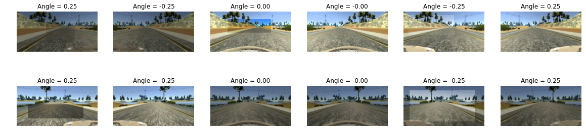
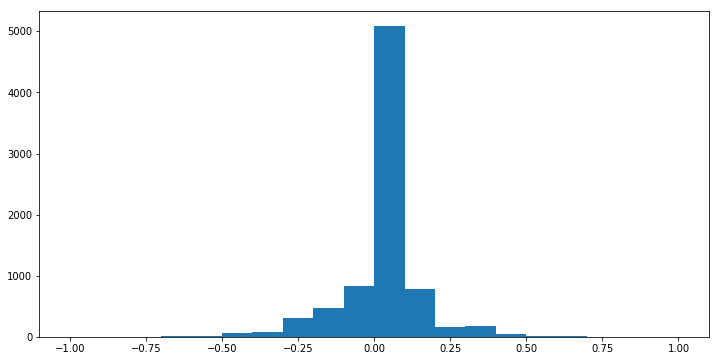
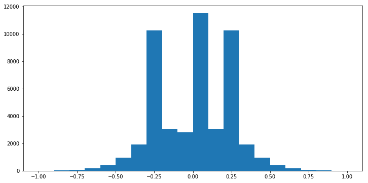
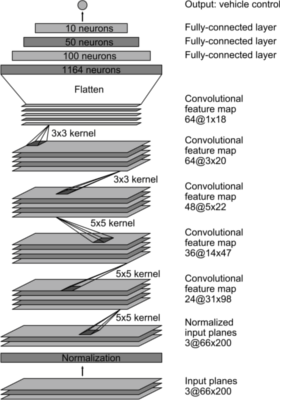
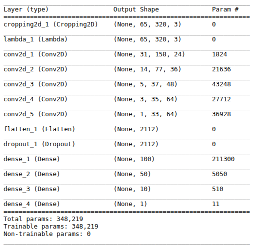
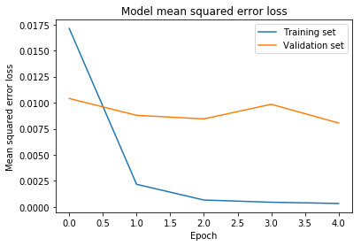

# **Behavioral Cloning Report**

### Introduction
In this project I used the Nvidia self driving car network and implmeneted the network using `Keras (v2)`. I used the udacity dataset and apply multiple augmentation on the images and use the steering angle as the output of the network.

---

### Data information

I use the augmentation factor to `6` which means I generate 6 images from each data set (left, center, right and one flipped of each of them). So my data set information is 
>Total size => 48216 samples
Training size => 34710 samples
Test size => 9648 samples
Validation size => 3858 samples

I use 20% of data to test, 8% to validation and the rest (72%) for the training.

---

### Augmentation
In the augmentation part I change the brightness of each image (left, center and the right). The next step is to add a random rectangular shadow to the images and add them to dataset. I also flipped the changed brightness images (and reverse their angle) and use them in the dataset too. 

Augmentation used to apply this way:
1. On 40% of dataset I change the brightness
2. On 20% of dataset I add random shadow rectangle

##### Image0: [left, flipped left, center, flipped center, right, flipped right]

For the left and right images I use this formula for the steering angle

	left_steering_angle = center_angle + 0.25
	right_steering_angle = center_angle - 0.25

--- 

### Data Generator

Because We cann't load the whole data set into the memory I use generator functions to input the data set to the network. For this, I use Keras `fit_generator` function and load images step by step in each epoch. 
	
The sterring angles distibition is shown below

And after the augmentation part 

So as it shows I use all images and their flipped version of them with some augmentaion (Generally I just change the brightness) and enrich the original dataset with this approach

  
#### TODO:
I can add more augmentaion detail (like shifting images)

---

### Network

As mention before, I used the Nvidia model for the training part but I also add a dropout layer (With keep_prob = 0.5) to avoid overfitting.

The nvidia is like below

And my network is like 

The zero layer (loading imag) I apply the `GaussianBlur` filter to the images to make them smoother.

The first layer is the cropping layer which crop the images to avoid extra working to learn the network (Remove sky, trees, ... )
The second layer is used the `normalization` for each pixel normalized the R, G and B and change the value of them between (-0.5, +0.5)

The rest of network is exactly like Nvidia networkd with a small diffrence in the flatten part which I've added a dropout layer to avoid overfitting.

---
### Learning

I use `adam` optimizer to do learning part and `MSE` method to minumum the error between network angle and the real steering angle. The network has `5` epoch and I monitor the training and validation erros.

and total error is `0.08448606552644854`